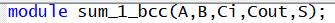

# lab01- sumador 
laboratorio 01 introducción a HDL
	
Julián Andrés Caipa Prieto

La modificación de este documento de lectura representa el primer paso de trabajo, primer acercamiento a plataformas github y manejo de repositorios y versiones.

1. Se realiza la apertura por primera vez del quartus, creando un proyecto nuevo por primera vez, buscando las indicaciones de la tarjeta altera brindada 
Altera Cyclone IV EP4CE10E22C8N sin encontrarla, encontrando EP4CE10E22C8.

2. Se va a 'File'>New>Verilog HDL File para crear el archivo que contendrá el módulo del sumador. 

3. Para iniciar el desarrollo del módulo sumador de 1-bit, se genera el módulo, que es como una especie de función de programación típica, la cuál tendrá
5 variables, A y B entradas binarias a sumar, Ci el carry de entrada de la suma (si se generá carry) y las sálidas S (Carry de sálida) y Cout (suma total):

