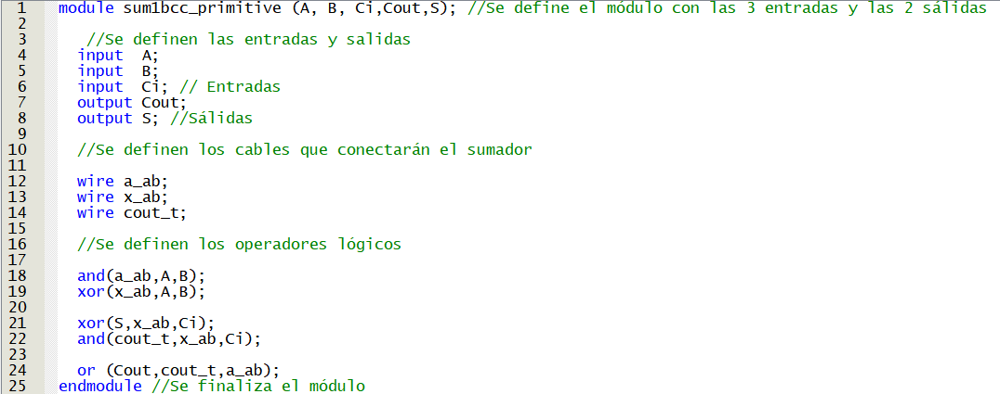

# lab01- sumador 
laboratorio 01 introducción a HDL
	
Julián Andrés Caipa Prieto

La modificación de este documento de lectura representa el primer paso de trabajo, primer acercamiento a plataformas github y manejo de repositorios y versiones.

1. Se realiza la apertura por primera vez del quartus, creando un proyecto nuevo por primera vez, buscando las indicaciones de la tarjeta altera brindada 
Altera Cyclone IV EP4CE10E22C8N sin encontrarla, encontrando EP4CE10E22C8.

2. Se va a 'File'>New>Verilog HDL File para crear el archivo que contendrá el módulo del sumador. 

3. Se comenza el trabajo de laboratorio siguiendo las indicaciones de la guía informe presentada por el docente, en la sección entregables.

 3.1. Análisis de los códigos brindados del sumador de 1 bit y las diferencias entre ellos: Se presenta primero el sumador primitivo, el cual opera con operdores lógicos sencillos y cables de conexión entre las entradas y las sálidas.
	
 
