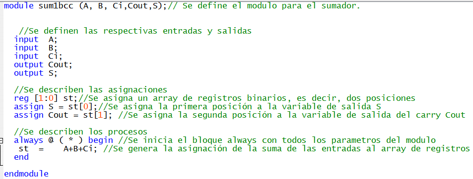
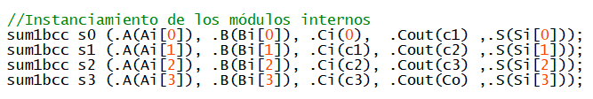

# lab01- sumador 
laboratorio 01 introducción a HDL
	
Julián Andrés Caipa Prieto

La modificación de este documento de lectura representa el primer paso de trabajo, primer acercamiento a plataformas github y manejo de repositorios y versiones.

**1.** Se realiza la apertura por primera vez del quartus, creando un proyecto nuevo por primera vez, buscando las indicaciones de la tarjeta altera brindada 
Altera Cyclone IV EP4CE10E22C8N sin encontrarla, encontrando EP4CE10E22C8.

**2.** Se va a 'File'>New>Verilog HDL File para crear el archivo que contendrá el módulo del sumador. 

**3.** Se comenza el trabajo de laboratorio siguiendo las indicaciones de la guía informe presentada por el docente, en la sección entregables.

 **3.1. Análisis de los códigos brindados del sumador de 1 bit y las diferencias entre ellos:** 
 
 Se presenta primero el sumador primitivo, el cual opera con operdores lógicos sencillos y cables de conexión entre las entradas y las sálidas.
	
 

Y se realizan las pruebas de funcionamiento en ModelSim visualizando las ondas de resultado del sumador. Análizando la tabla de verdad, se presenta el caso:

Y en las ondas, se verifica que el sumador funciona, como es posible ver aquí, gracias al testbench asociado:

Ahora, se realiza el sumador de 1 bit normal, el cual opera con un bloque tipo always que ejecuta la suma y la almacena en un array de reg:

Y se realizan las pruebas de funcionamiento en ModelSim visualizando las ondas de resultado del sumador, y estas, se verifica que el sumador funciona, como es posible ver aquí, gracias al testbench asociado, estudiando el mismo caso puntual del primitivo:

Las diferencias entre los sumadores rádican en la forma del código, mientras el primero emplea wire que solo permiten el trasporte de datos y compuertas lógicas, el segundo implementa almacenamiento y transporte con el uso de un array reg, y esto en un bloque always que ejecuta la suma de dichos valores y los asigna de la forma pertinente.

**3.2 Generación del nuevo proyecto y escritura del sumador de 4 bits:**

Primero, se trabaja el sumador de 1 bit visto previamente, para el cual se comienza describiendo el módulo, y luego las señales, asignaciones y el bloque always, como el código analizado previamente, escogiendo esto por la facilidad de manejo tanto de always como reg:

Ahora, se debe instanciar el sumador de 4 bits, primero, se genera el módulo controlador con sus respectivas entradas y salidas:

Se generan los wire que van a trasportar los valores de los carry, ya que, las entradas son arreglos de 4 espacios y estos almacenan sus propios valores y se trasportan a través de las instancias de los subcircuitos de sumador de 1 bit:

Por último, se crean las instancias de los modulos de 1-bit, generando las conexiones en el orden como se puede ver en la siguiente imágen:

Así pues, los módulos instanciados resultan como:

Y así se completa el código del sumador de 4-bits. Es posible comprobar este desarrollo haciendo uso de la herramienta RTL viewer, para ver el ordenamiento de lo que se realizó en el archivo y verificar según el ejercicio dado obteniendo un esquematico del circuito:

**3.3 Generación del testbench para ejecutar el sumador de 4-bits:**

Como se debe generar una simulación que permita efectuar todas las posibilidades del circuito diseñado sumador de 4 bits, es necesario escribir un testbench que la efectúe de la manera mas optima. Se crea primeramente le archivo para escribir el módulo testbench, y se define este con sus respectivas entradas y sálidas:

Posteriormente se escribe la instancia del módulo sumador de 4-bits que ejecutará el testbench con sus señales descritas, es decir, la unidad de testeo:

Se escribe el código de inicio de la simulación, el cual contiene las acciones que se ejecutarán para el módulo introducido de sumador de 4-bits. Este va compuesto por un ciclo for que genera las iteraciones para construir todos los posibles casos, un ciclo if que analiza la comparación de yi, es decir, la entrada cambiante del ciclo, un # que indica el tiempo de duración de la pausa en cada iteración de ciclo, y un comando $display, que muestra los resultados de forma decimal en pantalla:

Y finalmente, se escribe el código de la inicialización del caso de prueba, el cuál incluye un archivo dummy que almacenará el caso y unas variables dummy que guardarán la unidad de testeo temporal, y un tiempo hasta finalizar de 200 unidades de tiempo.

NOTA: Para que la simulación funcione correctamente, es necesario vincular la testbrench recién creada al sumador.

**3.4 Simulación y recolección de resultados:**

Al realizar la simulación en RTL Simulation, con la herramienta ModelSim, automáticamente se generan las gráficas de las ondas con todos los posibles casos y además, mostrando el valor de cada caso, recorriendo desde 0000 hasta 1111 y cumpliendo con la tabla de verdad:

Suponiendo un caso para comprobar la efectividad del sumador, en el cual, la entrada 1 vale 0100 y la entrada 2 vale 0010. Al operar esto nos resulta en 0110 sin Carry de sálida. Verificando en la gráfica de señal generada:

Así se comprueba el correcto funcionamiento del sumador de 4-bits.

**3.5 Simulación en la tarjeta Altera brindada**

Como parte final del trabajo, y aprovechando los recursos brindados por la universidad, se probará el funcionamiento del código en la tarjeta fpga Altera modelo Cyclone IV EP4CE10E22C8N. 

Para esto, es requerido inicialmente conocer las condiciones de los puertos o pines del chip de la tarjeta y cuales queremos activar, en este caso, se requieren activar los 8 switches y 5 bombillos led. Para esto, podemos consultar las partes y números de pines en una página que brinde información como la siguiente:
http://land-boards.com/blwiki/index.php?title=A-C4E10_Cyclone_IV_FPGA_EP4CE10E22C8N_Development_Board

O también se puede observando la tarjeta y las marcas que esta trae.

Ahora bien, ya conocemos cuales son los números de pin para los switches, y se asignaran, para la entrada A los pines del 65 al 68, y para la B los pines del 58 al 64, y para los leds de salida, 72 a 75, y para el Carry 76.

Para realizar la asignación de los pines, es requerido dirigirse al Pin planner de Quartus, como se aprecía en la siguiente imagen:

Esto nos despliega una pantalla como la siguiente, donde se visualiza el chip y todos sus pines:

Allí, nos dirigimos a la parte inferior, y procedemos a realizar la asignación como lo mencionado previamente desde el bit mas significativo al menos significativo:

Y una vez realizado esto, compilamos el proyecto y procedemos a conectar la tarjeta al computador, para poder programarla con el código correspondiente y las asignaciones realizadas. Es necesario conectar ambos cables, tanto el de USB-BLASTER, como el cable de poder. Adicionalmente, se debe instalar el controlador requerido para el manejo del usb-blaster en caso de que no sea reconocido automáticamente, un proceso un poco tedioso y que no es fin de este informe, se puede consultar en línea, o en vídeos de ejemplo como el siguiente: https://www.youtube.com/watch?v=_IIQ_w6B1b8.

Posteriormente, con la conexión de la tarjeta realizada, nos vamos al Programmer de Quartus en la sección Tools como se ve en la siguiente figura:

Y al abrirlo nos presenta un módulo como el siguiente, en el cual se detecta automáticamente la tarjeta (de no ser así, le damos autodetect en los botones de la parte lateral izquierda, y luego en el menú desplegable al lado de Hardware Setup colocamos USB-Blaster [USB-0]), y en dicho módulo damos a Start para que inicie la programación de la tarjeta hasta que nos muestre 100% Successful, indicando la correcta programación de la misma:

Y observamos los resultados en la tarjeta: 

En donde rápidamente es posible evidenciar un error, ya que, estando todos los switches "apagados", se encuentra prendido el resultado como si fuera 0001. 

Para la corrección de este error, y de la mano con trabajo de tutoría docente, se encontró que la tarjeta presenta dos condiciones que se deben tener en cuenta en el código y el manejo de la misma, primero, las salidas deben negarse por la disposición interna de las conexiones de los pines en la tarjeta, y la segunda, los switches están invertidos. Con estos ajustes realizados, se corrige el código (OJO, solo para el uso en la tarjeta, estos cambios afectan notablemente los resultados en Testbench y simulaciones internas de Quartus), resultando en:

Y se obtienen finalmente los resultados existosos en la tarjeta altera del sumador de 4 bits.

