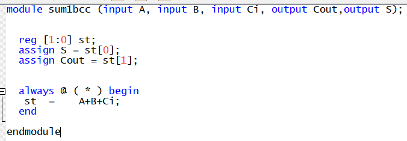
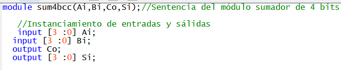
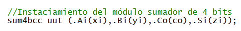

# lab01- sumador 
laboratorio 01 introducción a HDL
	
Julián Andrés Caipa Prieto

La modificación de este documento de lectura representa el primer paso de trabajo, primer acercamiento a plataformas github y manejo de repositorios y versiones.

1. Se realiza la apertura por primera vez del quartus, creando un proyecto nuevo por primera vez, buscando las indicaciones de la tarjeta altera brindada 
Altera Cyclone IV EP4CE10E22C8N sin encontrarla, encontrando EP4CE10E22C8.

2. Se va a 'File'>New>Verilog HDL File para crear el archivo que contendrá el módulo del sumador. 

3. Se comenza el trabajo de laboratorio siguiendo las indicaciones de la guía informe presentada por el docente, en la sección entregables.

 3.1. Análisis de los códigos brindados del sumador de 1 bit y las diferencias entre ellos: Se presenta primero el sumador primitivo, el cual opera con operdores lógicos sencillos y cables de conexión entre las entradas y las sálidas.
	
 

Y se realizan las pruebas de funcionamiento en ModelSim visualizando las ondas de resultado del sumador. Análizando la tabla de verdad, se presenta el caso:

Y en las ondas, se verifica que el sumador funciona, como es posible ver aquí, gracias al testbench asociado:

Ahora, se realiza el sumador de 1 bit normal, el cual opera con un bloque tipo always que ejecuta la suma y la almacena en un array de reg:

Y se realizan las pruebas de funcionamiento en ModelSim visualizando las ondas de resultado del sumador, y estas, se verifica que el sumador funciona, como es posible ver aquí, gracias al testbench asociado, estudiando el mismo caso puntual del primitivo:

Las diferencias entre los sumadores rádican en la forma del código, mientras el primero emplea wire que solo permiten el trasporte de datos y compuertas lógicas, el segundo implementa almacenamiento y transporte con el uso de un array reg, y esto en un bloque always que ejecuta la suma de dichos valores y los asigna de la forma pertinente.

3.2 Generación del nuevo proyecto y escritura del sumador de 4 bits:

Primero, se trabaja el sumador de 1 bit visto previamente, para el cual se comienza describiendo el módulo, y luego las señales, asignaciones y el bloque always, como el código analizado previamente, escogiendo esto por la facilidad de manejo tanto de always como reg:

Ahora, se debe instanciar el sumador de 4 bits, primero, se genera el módulo controlador con sus respectivas entradas y salidas:

Se generan los wire que van a trasportar los valores de los carry, ya que, las entradas son arreglos de 4 espacios y estos almacenan sus propios valores y se trasportan a través de las instancias de los subcircuitos de sumador de 1 bit:

Por último, se crean las instancias de los modulos de 1-bit, generando las conexiones en el orden como se puede ver en la siguiente imágen:

Así pues, los módulos instanciados resultan como:

Y así se completa el código del sumador de 4-bits. Es posible comprobar este desarrollo haciendo uso de la herramienta RTL viewer, para ver el ordenamiento de lo que se realizó en el archivo y verificar según el ejercicio dado obteniendo un esquematico del circuito:

3.3 Generación del testbench para ejecutar el sumador de 4-bits:

Como se debe generar una simulación que permita efectuar todas las posibilidades del circuito diseñado sumador de 4 bits, es necesario escribir un testbench que la efectúe de la manera mas optima. Se crea primeramente le archivo para escribir el módulo testbench, y se define este con sus respectivas entradas y sálidas:

Posteriormente se escribe la instancia del módulo sumador de 4-bits que ejecutará el testbench con sus señales descritas, es decir, la unidad de testeo:

Y finalmente se escribe el código de inicio de la simulación, el cual contiene las acciones que se ejecutarán para el módulo introducido de sumador de 4-bits. Este va compuesto por un ciclo for que genera las iteraciones para construir todos los posibles casos, un ciclo if que analiza la comparación de yi, es decir, la entrada cambiante del ciclo, un # que indica el tiempo de duración de la pausa en cada iteración de ciclo, y un comando $display, que muestra los resultados de forma decimal en pantalla:

NOTA: Para que la simulación funcione correctamente, es necesario vincular la testbrench recién creada al sumador.

3.4 Simulación y recolección de resultados:

